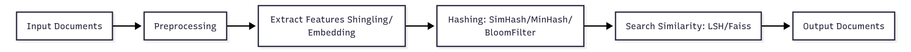
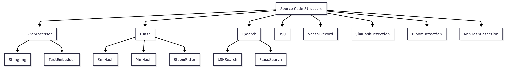

# Duplication Text
Hệ thống phát hiện văn bản trùng lặp sử dụng Hashing và Embedding hiện đại.  

---

## 📖 Giới thiệu
Dự án được xây dựng cho học phần mở rộng **Cấu trúc dữ liệu và Giải thuật**, nhằm phát hiện và loại bỏ các văn bản trùng lặp hoặc tương tự trong tập dữ liệu lớn (bài viết, bình luận,...).

## 🚀 Mô tả
- Trích xuất đặc trưng văn bản bằng mô hình `all-MiniLM-L6-v2`
- Áp dụng các kỹ thuật băm: **SimHash**, **MinHash**, **BloomFilter**
- Tìm kiếm tương đồng gần giống: **LSH**, **Faiss**
- Giao diện trực quan bằng **Gradio**

## 🛠️ Quy trình và cấu trúc mã nguồn
### Pineline

### Cấu trúc

---
## 📄 Report : 
* Chi tiết cách triển khai + cơ chế được trình bày trong [report]()
---
## 📝 Colab
1. Đánh giá precise/recall/F1 score về 3 phương pháp được sử dụng : [demo](https://colab.research.google.com/drive/1o1-CAwPNq9E4pYC2eHI5YzXxxwapfhQt?usp=sharing)
2. Đánh giá mức độ sử dụng bộ nhớ  của 3 phương pháp : [demo](https://colab.research.google.com/drive/1B_XhvkkWgPJnxAY2CHhRAEjYRb2wiIku?usp=sharing)
3. Đánh giá, so sánh tốc độ thực thi của 3 phương pháp được sử dụng : [demo](https://colab.research.google.com/drive/1J-iLNpH-PLPtxKQLlAXqLvJbCexVNV32?usp=sharing)

---
## ⚙️ Demo 
1. Truy cập [demo](https://huggingface.co/spaces/DatNguyen-BK/demo_deploy)
2. Upload file `.docx`, `.txt`, hoặc `.csv`.
3. Chọn phương pháp: **SimHash (Semantic)**, **Bloom + Faiss (Semantic)** hoặc **MinHash (Syntax)**.
4. Submit và quan sát kết quả gộp nhóm văn bản và kết quả lọc văn bản.
5. Tải file kết quả đã lọc văn bản `result.docx`.

---

## 📌 Ghi chú

* Truy cập colab/demo trực tiếp để chạy code.
* Run all trên colab
* Thầy có thể mở lại các cell bất kỳ để kiểm tra chi tiết

